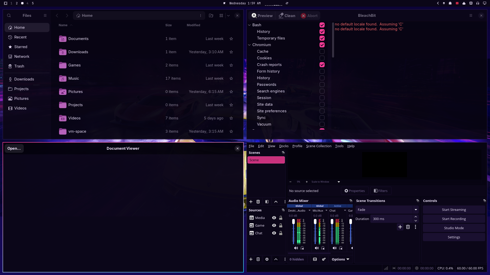

# Chroma

**Omarchy themes your terminal, editor, and shell. Chroma is the big
one-sweep: it paints the GTK and Qt *pipelines* most desktop apps already
use, so dozens of programs pick up the active theme without a Style picker
or a per-app skin.**



Stock Omarchy flips Nautilus, BleachBit, Evince and friends between light and
dark Adwaita. That is all they ever get: the same default grey in every theme.
Your desktop wears Hackerman neon; your file manager wears beige.

Chroma closes that gap. Enable it once and every `omarchy theme set` paints
GTK3, GTK4 / libadwaita, and Qt (via Omarchy's stock `QT_QPA_PLATFORMTHEME=gtk3`)
with the active theme's real colours — background, foreground, accent,
destructive / success / warning — light and dark alike.

No Style carousel. You are not picking between “GTK” and “Qt” like they were
themes — you are feeding colour data into the two toolkits almost every
non-Electron Linux GUI shares. One hook, every `colors.toml` Omarchy knows
about (stock, user forks, third-party installs). That is the whole point.

## Why this exists (and where it stops)

I spent time on **Archinstall + Hyprland + [Noctalia](https://github.com/noctalia-dev/noctalia-shell) 4.x + Catppuccin** across a whole system. Their theming engine was (and probably still is) excellent — credit where it is due. Sitting in that setup while Omarchy 3.x still felt thin on theming, I got the itch to theme *everything*. Most of that Noctalia-era work was manual and locked to one palette anyway. When Hypr Lua configs got messy and I did not want to babysit them, I came back to Omarchy with a bit of restraint: extend what actually accepts colour data, leave the rest alone.

What actually tipped me into building these extenders was a theme that already looked *good* on stock Omarchy ([Asphalt Legends](https://github.com/AlxWolfenstein97/omarchy-asphalt-legends-theme) and friends). Fair that Omarchy only goes so far in the core (4.x does more of the shell now, yes) — once a palette sits cleanly there, it’s natural to ask how far the same `colors.toml` can ride without becoming a cat-and-mouse fight. So: care, a stop-line, and something meant to beat that old one-theme manual stack while still working across **every** installed theme. That last part is deliberate incentive — for me and for anyone else writing themes — to make more of them, because the desktop can follow further without each repo shipping its own private theming engine.

Omarchy 4 baked agents, skills, and docs into the distro. DHH’s tagline moved toward *Beautiful, Fun & Agentic Linux* — and with that tooling in place, those Noctalia-era ideas got Omarchy-fied: itemised plugins that read the same 3.x `colors.toml` format, convert where needed, and work across every theme by design. Formats can grow later; the contract is “give us colour data (or something we can convert).”

The [plugin marketplace](https://plugins.omarchy.org/) feels a bit like a game workshop, except you’re not modding a game — you’re modding the system. A few of those “just a few things,” until they add up. I assumed someone else would fill gaps like this first; contributing anyway has been fun, and it was a concrete way to learn what “plugins run unsandboxed code” actually means (bootloader colours will teach you that “you can touch everything” real quick). Thousands of plugins in a month makes more sense when AI meets a shell that powerful. Handy homework if I ever roll my own Arch (or car) experiment again.

These plugins push [DHH](https://dhh.dk/) / Omarchy’s colour-coordinated desktop as far as it can **reasonably** go. Limitations are documented on purpose. If upstream never wants them as official defaults because of those trade-offs, that is fine — they stay optional. I change themes roughly every three weeks to every three months; for that cadence the restart quirks are cheap. Themes keep working without any of this. Authors can stick to the snappier stock pipeline. End users pick the extenders they want. The inch-a-lada is optional; making the system feel like *yours* is the point.

Sibling Style plugins ([OmaOBS](https://github.com/AlxWolfenstein97/omaobs), [OmaCursor](https://github.com/AlxWolfenstein97/omacursor), [OmaBoot](https://github.com/AlxWolfenstein97/omaboot), [OmaVT](https://github.com/AlxWolfenstein97/omavt), [OmaTTY](https://github.com/AlxWolfenstein97/omatty), [OmaHud](https://github.com/AlxWolfenstein97/omahud)) target one surface each and ship a Style carousel so you can preview the same palette (or font / HUD tint) across every installed theme faster than flipping by hand. Those pickers draw PNG mockups with **Pillow** (`python-pillow`) — their installers pull that package *before* warming tiles. Chroma is different: it is the broad toolkit sweep, so silent `theme-set` sync is the right UX — **no carousel to warm**, and **no Pillow**. [OmaMenu](https://github.com/AlxWolfenstein97/omamenu) is the same story (shell/Quickshell only). None of these plugins require each other; together they cover a lot.

Theme authors are free to mention these as extenders in their repos — or not. Grab whatever theme you like; the plugins still apply.

### Why GTK & Qt (pipelines, not apps)

Most “apps” on a Linux desktop are not custom paint engines. They speak **GTK** or **Qt**. Recolor those pipelines and you recolor Nautilus, Evince, BleachBit, File Roller, qBittorrent, qpwgraph, and a long tail of friends in one shot — without asking each upstream for a theme file.

That is the opposite of shipping a skin for OBS (where a real theme format exists — see OmaOBS) or patching Chromium / Steam / a website. Those either have no stable colour contract, own their own UI chrome, or update on someone else’s schedule. Fighting that is a cat-and-mouse game with people who never asked for your patches; asking strangers to install your fork of Chromium or Steam is weirder still. Websites are worse: content CSS is not your desktop.

**Hard stop:** if something cannot wear *any* installed Omarchy theme from `colors.toml` alone after a full restart — without binary forks, per-site CSS farms, or chasing remote content — Chroma (and this family of plugins) will not pretend it can. Leftovers that feel half-assed if forced: the open web, Steam Library / friends / settings, WhatsApp / Voice web UIs, LibreOffice document paper, mpv OSC, Goverlay chrome, one-off custom button skins. Unthemed beats fake.

Inspired by [Accord](https://github.com/vonsensey/accord), which proved the GTK `@define-color` bridge on Omarchy. Chroma keeps that core idea, hooks it straight into `theme-set.d` for an instant apply, prefers `adw-gtk3` when installed so GTK3 actually consumes the palette, and optionally themes root GUIs (`sudo` / `pkexec` BleachBit) with a one-time symlink — without forcing `qt6ct` or fighting Omarchy's Qt defaults.

## What you get

- **GTK4 / libadwaita** — Nautilus, Evince, Calendar, Text Editor, Loupe, …
  via `~/.config/gtk-4.0/gtk.css` (the only user lever libadwaita honors).
- **GTK3** — classic named colours + dialog polish in
  `~/.config/gtk-3.0/gtk.css`, with `adw-gtk3` / `adw-gtk3-dark` when the
  package is present so those variables actually stick.
- **Qt 5 / Qt 6** — stays on Omarchy's `QT_QPA_PLATFORMTHEME=gtk3`, so Qt
  inherits the GTK3 palette Chroma just wrote. No qt6ct, no Kvantum, no
  shell-side icon side effects.
- **Root apps (optional)** — one-time
  `/root/.config/gtk-*` → your configs, so `sudo bleachbit` / pkexec GUIs
  match. Password once; every later theme switch follows for free.
- **Light and dark** — `color-scheme` and `gtk-theme` stay mode-correct,
  preferring adw-gtk3 over stock Adwaita when available.


## Marketplace consent (hooks & Style menu)

Installing the plugin only drops the code. Style menu rows and theme-set hooks
edit your Omarchy config, so they stay **opt-in**.

**Fast path (no prompts)** — from your home folder:

```sh
~/.config/omarchy/plugins/io.github.alxwolfenstein97.chroma/install.sh --yes
```

`--yes` means: I consent — arm everything this plugin supports, skip Y/n. Interactive `./install.sh` (no `--yes`) still asks — Workshop-safe; `--yes` / arm-all are optional shortcuts.
Theme-set helper: `./tools/install-theme-hook.sh --yes`.

**Arm the whole family in one shot** (after all plugins are installed):

```sh
~/.config/omarchy/plugins/io.github.alxwolfenstein97.chroma/tools/arm-all-family.sh
```

**Full wipe (this plugin)** — same ease as `install.sh --yes`
(full teardown + `plugin remove`; best-effort `pkg drop` for deps this plugin
may have pulled — kept only when pacman still needs them elsewhere):

```sh
~/.config/omarchy/plugins/io.github.alxwolfenstein97.chroma/uninstall.sh --yes
```

**Wipe the whole family** (runs each plugin’s `uninstall.sh --yes` — same full
teardown as a single-plugin wipe — then a final shared-dep sweep):

```sh
~/.config/omarchy/plugins/io.github.alxwolfenstein97.chroma/tools/wipe-all-family.sh
```

Interactive `./install.sh` still asks [Y/n] if you prefer. Quiet shell restarts
only restore what you already armed. `./uninstall.sh --yes` is a full wipe for
that plugin (same teardown family wipe runs); without `--yes` you get TTY
prompts for optional package drops.


## Install

Workshop-style one paste (enable + integrate; installer asks [Y/n]):

```bash
omarchy plugin add https://github.com/AlxWolfenstein97/chroma.git --enable
~/.config/omarchy/plugins/io.github.alxwolfenstein97.chroma/install.sh
```

That clones into `~/.config/omarchy/plugins/io.github.alxwolfenstein97.chroma` and arms hooks / Style after you
confirm. Skip prompts: `~/.config/omarchy/plugins/io.github.alxwolfenstein97.chroma/install.sh --yes --with-root`.

Or from an existing checkout:

```bash
~/.config/omarchy/plugins/io.github.alxwolfenstein97.chroma/install.sh
omarchy plugin enable io.github.alxwolfenstein97.chroma
```

**Packages the installer pulls when missing:**

| Package | Why |
|---------|-----|
| `adw-gtk-theme` | GTK3 only honours libadwaita-style `@define-color`s when the active theme is `adw-gtk3` / `adw-gtk3-dark`. Without it Chroma still writes CSS, but classic GTK3 chrome often stays beige (Accord-like). |

`omarchy pkg add` needs sudo. Interactive `install.sh` asks in that TTY.
Shell-service `--quiet` never re-pulls `adw-gtk-theme` — that path only
restores already-armed wiring after login. Deps come from interactive
`install.sh`, `install.sh --yes`, or family `arm-all-family.sh`.
If the package is missing after a wipe: `omarchy pkg add adw-gtk-theme` then
`omarchy theme refresh` (or re-run `install.sh` without `--quiet`).

Nothing else. No Pillow — Chroma has no Style carousel. The Style siblings
(OmaCursor / OmaOBS / OmaBoot / OmaVT / OmaTTY / OmaHud) pull `python-pillow` for their
mockups; that is a separate dep family.

## How it works

1. A script in `~/.config/omarchy/hooks/theme-set.d/chroma` runs at the end of
   every `omarchy theme set` / `theme refresh`.
2. `bin/chroma-apply` reads the active theme's `colors.toml`, writes marked
   managed blocks into `gtk-3.0` / `gtk-4.0` CSS + `settings.ini`, and sets
   GNOME `color-scheme` / `gtk-theme`.
3. A small shell **service** runs `install.sh --quiet` once at shell start
   (restores the theme-set hook if already armed; skips package installs —
   deps are interactive / `arm-all` / `install.sh --yes`). It does **not**
   probe-and-reapply on a timer — the hook already covers switches, and a
   second path made boots/theme flips feel heavier than they needed to.
4. Windowless GTK daemons (`--gapplication-service`) and
   `xdg-desktop-portal-gtk` are restarted only on interactive apply when they
   have no open window, so open apps are never killed mid-use.

Idempotent: unchanged themes write nothing (byte-compared before write).

## What it writes — and what it does not

**Writes**

- `~/.config/gtk-4.0/gtk.css` and `gtk-3.0/gtk.css` — marked
  `chroma:managed` block; pre-existing user CSS is backed up once and kept.
- `~/.config/gtk-{3,4}.0/settings.ini` — theme name, prefer-dark, font
  (no icon / cursor keys — Omarchy owns those).
- Two gsettings keys: `color-scheme`, `gtk-theme` (originals saved for revert).
- `~/.local/state/omarchy/chroma/state.json` — last apply metadata.

**Optional ( `--with-root` )**

- Symlinks `/root/.config/{gtk-3.0,gtk-4.0}` → your matching dirs.
- On a TTY (arm-all / interactive / wipe), elevation uses `sudo` so the
  password lands in the same terminal; `pkexec` is only the non-TTY fallback.
- Apply runs **before** the root link so user GTK dirs exist before
  `/root/.config` points at them.

**Does not**

- Touch icon or cursor themes.
- Force `QT_QPA_PLATFORMTHEME` away from Omarchy's `gtk3`.
- Network. Ever.
- Kill any app that owns a visible window.
- Theme the open web, Steam chrome, or any app that ignores platform colours.

## Fresh VM smoke test

```sh
omarchy plugin add https://github.com/AlxWolfenstein97/chroma.git --enable
# No Style carousel — theme-set hook sweeps GTK/Qt/icons on every Omarchy theme flip
# Pick a loud theme; confirm apps follow (adw-gtk via install.sh / arm-all if missing)
# plugin add alone + reboot → quiet restores wiring only; run install.sh / arm-all for deps/hooks
# ./uninstall.sh --yes → full teardown (same as family wipe for this plugin)
# Interactive ./uninstall.sh → TTY: root teardown + optional adw-gtk drop
```

## Disable vs remove

| Action | What happens |
|--------|----------------|
| `omarchy plugin disable …` | Shell service stops. **Theme hook still runs** — apps stay chromed on every theme switch. |
| `./uninstall.sh` then disable / remove | Hook gone, CSS stripped, gsettings restored. Tombstone + disable **first**. This TTY: root symlink / sudoers teardown (sudo) + optional y/N `pkg drop adw-gtk-theme`. |
| `omarchy pkg drop adw-gtk-theme` | Optional. Back to stock Adwaita; only if nothing else needs adw-gtk3. Offered as a TTY y/N on uninstall. |

**Full wipe** — one shot (`--yes` skips pkg Y/n, best-effort drops deps this plugin may have pulled if nothing else needs them, and removes the plugin):

```sh
~/.config/omarchy/plugins/io.github.alxwolfenstein97.chroma/uninstall.sh --yes
```

## Limits, honestly

Most GTK and Qt apps are **not live**. Chroma writes the CSS / settings the
moment you switch themes; open windows often keep the previous paint until
you restart them. Same class of limitation [Accord](https://github.com/vonsensey/accord)
hit — probably not really fixable without killing windows mid-use, which we
refuse to do.

- **GTK apps** — many need a restart after a theme switch. The **file manager**
  (Nautilus) is especially finicky: close it fully, and sometimes an extra
  theme flip helps the next open pick up the new palette.
- **Qt** — picks the palette up at launch, not live. Relaunch after a switch.
- **Apps with their own skins** (OBS themes, Steam, some Electron) ignore
  platform GTK/Qt colours. Use a dedicated extender (OmaOBS, Omacord, …) or
  leave them — do not expect Chroma to invent a contract that is not there.
- **LibreOffice** themes chrome via GTK; some notebook/brand strips stay LO's
  own blue. Document background is a LO setting (“use printer metrics” /
  white-document prefs), not Chroma.
- **Flatpak** needs the usual hole:
  `flatpak override --user --filesystem=xdg-config/gtk-4.0:ro <app>`.
- We recolor stock Adwaita / adw-gtk3 rather than shipping a full theme
  engine — keeps the bridge small and update-safe on Omarchy's stack.

If you are not the type who flips themes every afternoon: pick something you
like, reboot once, profit. Live sync is for people who enjoy the carousel.

## Check

```sh
bash ~/.config/omarchy/plugins/io.github.alxwolfenstein97.chroma/check.sh
```

## Credits

- [Noctalia](https://github.com/noctalia-dev/noctalia-shell) — the theming
  engine that first made “theme the whole machine” feel reachable; these
  Omarchy plugins grew out of that itch, then learned where to stop.
- [Accord](https://github.com/vonsensey/accord) by vonsensey — proved Omarchy
  themes can drive libadwaita via user CSS, and set the craft bar for
  merge-safe managed blocks, luma-distance on-accent text, and
  never-kill-a-window restarts.
- Sibling extenders: [OmaOBS](https://github.com/AlxWolfenstein97/omaobs),
  [OmaCursor](https://github.com/AlxWolfenstein97/omacursor),
  [OmaBoot](https://github.com/AlxWolfenstein97/omaboot),
  [OmaVT](https://github.com/AlxWolfenstein97/omavt),
  [OmaTTY](https://github.com/AlxWolfenstein97/omatty),
  [OmaHud](https://github.com/AlxWolfenstein97/omahud); Discord:
  [Omacord](https://github.com/ASwenia/omacord).
- [OMCP](https://github.com/btsouth/omarchy-omcp) — MCP desktop bridge (themes,
  windows, screenshots, …). Helped build and iterate the preview here:
  `omarchy plugin add https://github.com/btsouth/omarchy-omcp --enable`
- [Omarchy](https://omarchy.org/) — theme pipeline, `theme-set` hooks, and
  the `gtk3` Qt platform theme this plugin deliberately stays aligned with.

## License

MIT — see [LICENSE](LICENSE).
